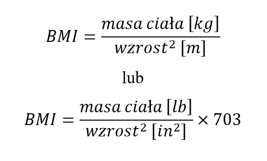

## Sieć neuronowa ucząca się obliczania BMI

Model sieci neuronowej stworzony w tym programie ma za zadanie nauczyć się, w jaki sposób obliczać BMI (Body Mass Index) bez posiadania powszechnie znanego nam wzoru, który wygląda następująco:
  

    

 

## Zestawy danych
Do nauki sieci wykorzystane zostały następujące zbiory danych:

- bmi_data.csv 
https://www.kaggle.com/datasets/freego1/bmi-data, dostęp: 24.01.2022

- diabetes.csv 
https://www.kaggle.com/datasets/houcembenmansour/predict-diabetes-based-on-diagnostic-measures , dostęp: 24.01.2022

